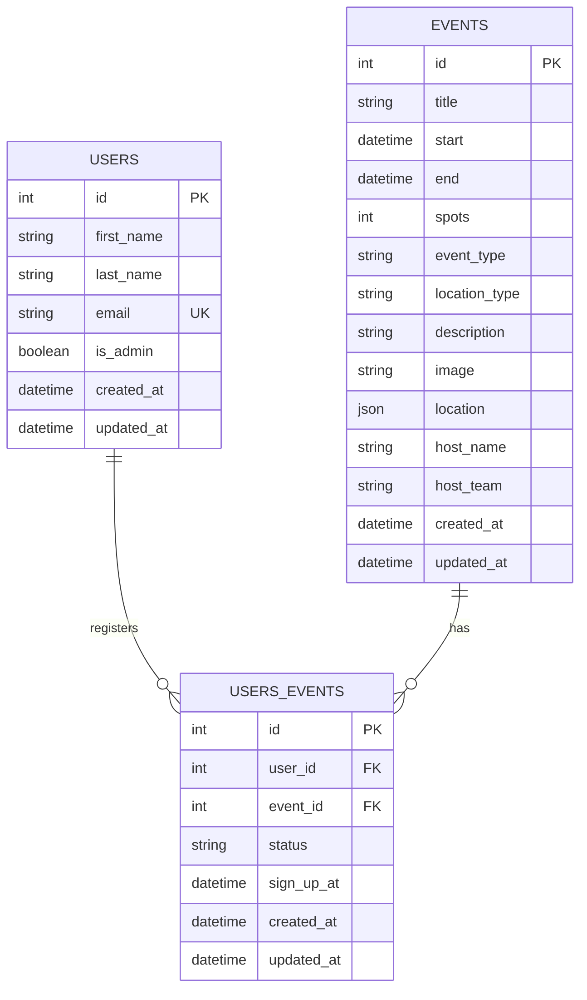

# Database Phase — Community Events Hub

## Context

`solution/BRIEF.md` is approved and complete, but the repo is a clean slate: `solution/` has only `BRIEF.md` and `PROMPT_LOG.md`, no backend/frontend code, no dependency files, no `.gitignore` rules for Python/Node artifacts. Per the user's request, implementation is being broken into per-phase plan docs, reviewed and approved one at a time before execution. This is the **first phase: database + backend project setup** — schema, migrations, seed data, tests, and documentation for the persistence layer — with no Flask routes, auth, or frontend yet (those are later phases).

Confirmed with the user before/during design:
- Plan docs live at the repo root (`tier-3-vibe-mvp/PLAN-database.md`), not under `solution/` — a deliberate one-off exception to CLAUDE.md's "all supporting docs under `solution/`" rule; the app code itself still lives under `solution/backend/`.
- Python dependency management: **Poetry**.
- ORM: **SQLAlchemy + Flask-SQLAlchemy**.
- Seeded event cover photos are **copied** into a new `solution/backend/uploads/events/` (git-ignored), not referenced in place from `mockups/`.
- **Alembic** manages schema evolution, and the initial seed data is applied as part of the migration chain — not a separate ad-hoc script.
- Model behavior/constraints get **pytest** unit-test coverage.
- The backend ships its own `README.md` (setup/config/DB-layer orientation) plus `docs/DATABASE.md` (full schema reference with a Mermaid ER diagram).
- Every optional field on the seeded Events is filled in — no nulls in the fixture data.

Repo/toolchain facts gathered during exploration: Python 3.14.7, pip, and Poetry 2.4.1 are all available. The 7 seed photos live at `mockups/project/assets/photos/` (`ama-room.jpg`, `rooftop-lounge.jpg`, `rooftop-social.jpg`, `rooftop-swing.jpg`, `study-classroom.jpg`, `workshop-room.jpg`, `workshop-studio.jpg`). Node/asdf activation is needed eventually for the frontend phase, but is out of scope here.

## Status

**Done.** All 10 verification steps pass on a from-scratch checkout.
- [x] Scaffold `solution/backend/` (Poetry project, config, extensions, models)
- [x] Alembic migrations (schema + seed data)
- [x] `scripts/seed_data.py` fixtures
- [x] pytest coverage for models/constraints (15 tests)
- [x] `solution/backend/README.md` + `solution/backend/docs/DATABASE.md`
- [x] `.gitignore` updates
- [x] Full verification run (see below)

**One real mistake caught during execution** (logged in
`solution/PROMPT_LOG.md`): the enum columns (`event_type`, `location_type`,
`status`) initially had **zero DB-level `CHECK` enforcement**. SQLAlchemy
2.0 quietly changed `Enum`'s `create_constraint` default from `True` to
`False`, so the originally-written model code (which matched this plan's
first draft) produced bare `VARCHAR` columns. It surfaced as a failing
pytest test expecting an invalid enum value to be rejected — instead the
bad value inserted silently and only broke later, confusingly, as a
`LookupError` on read-back. Fixed by passing `create_constraint=True`
explicitly on all three enum columns; `docs/DATABASE.md` documents this
and the tests now pin the correct (`IntegrityError`-at-write) behavior.

## Approach

### Folder layout

```
solution/backend/
├── pyproject.toml            # Poetry, package-mode = false; deps: flask, flask-sqlalchemy,
│                               #   python-dotenv, alembic; dev group: pytest
├── poetry.lock                 # committed — reproducible installs
├── alembic.ini
├── .env.example                 # committed; .env itself is git-ignored
├── README.md                     # NEW — backend setup/config/DB orientation
├── app/
│   ├── __init__.py               # create_app() factory
│   ├── config.py                  # Config + BASE_DIR/INSTANCE_DIR/UPLOAD_DIR + ensure_runtime_dirs()
│   ├── extensions.py              # db = SQLAlchemy(); SQLite foreign_keys=ON connect listener
│   ├── cli.py                     # `flask db-setup` — ensures dirs, copies photos, runs Alembic to head
│   └── models/
│       ├── __init__.py            # imports User/Event/Registration so db.metadata sees them
│       ├── mixins.py              # TimestampMixin (created_at/updated_at)
│       ├── enums.py               # EventType, LocationType, RegistrationStatus
│       ├── user.py
│       ├── event.py
│       └── registration.py
├── migrations/                    # Alembic
│   ├── env.py                     # target_metadata = db.metadata; render_as_batch=True for SQLite
│   ├── script.py.mako
│   └── versions/
│       ├── 0001_initial_schema.py     # autogenerated: CREATE TABLE x3 + all constraints
│       └── 0002_seed_initial_data.py  # data migration: inserts fixture users/events/registrations
├── scripts/
│   └── seed_data.py                # pure fixture data (no DB session) + copy_seed_photos() —
│                                      #   imported by the 0002 migration so the data lives in one place
├── tests/
│   ├── conftest.py                 # app+db fixtures against a temp-file SQLite DB (via db.create_all(),
│   │                                  #   not Alembic — see rationale below)
│   ├── test_user_model.py
│   ├── test_event_model.py
│   └── test_registration_model.py
├── docs/
│   └── DATABASE.md                  # full schema reference + Mermaid ERD
├── instance/                         # git-ignored, created at runtime — app.db lives here
└── uploads/events/                    # git-ignored, created at runtime — seeded photos copied here
```

### Schema — matches BRIEF §7.3 exactly, with SQLite-specific translation decisions

- **`bigint` PKs → `db.Integer`.** SQLite's `INTEGER` storage class is already 8-byte; more importantly, SQLite only aliases a PK column to its fast native `rowid` (auto-increment) when the DDL says exactly `INTEGER PRIMARY KEY` — telling SQLAlchemy to use `BigInteger` would emit `BIGINT PRIMARY KEY`, which loses that rowid aliasing for zero benefit.
- **Enums → `db.Enum(PyEnum, values_callable=...)`.** SQLite has no native enum type; SQLAlchemy emits `VARCHAR` + a `CHECK (col IN (...))` constraint, so enforcement is real at the DB layer. `values_callable` is required because BRIEF's wire values (`study_group`, `Confirmed`) aren't valid Python `UPPER_SNAKE` member names — without it, SQLAlchemy silently persists the member *name* instead of its *value*.
- **`location` array(text) → `db.JSON`.** Stored as `TEXT` with automatic Python-list ↔ JSON (de)serialization at the ORM boundary; no SQLite extension needed.
- **`created_at`/`updated_at`** via a `TimestampMixin`: `default=` on insert, `onupdate=` refreshes automatically on any ORM-level `UPDATE` that touches another column.
- **`(user_id, event_id)` unique constraint** on `Registration` — a real DB-level `UNIQUE INDEX`.
- **SQLite foreign keys are OFF by default per-connection** — `app/extensions.py` registers a `connect` event listener that runs `PRAGMA foreign_keys=ON` on every new DBAPI connection.
- **Two structural `CHECK` constraints**, because they're literally how BRIEF types the columns: `spots > 0` and `"end" > start` (`end` is a reserved SQLite keyword, auto-quoted by SQLAlchemy; hand-written `sqlite3` CLI queries must quote it too).
- **Deliberately not enforced at the DB layer**: text length bounds, email format, image content checks, virtual-location URL checks — genuine business-validation rules that belong in the future API phase.

### Migrations — Alembic owns schema *and* initial seed data

- `alembic.ini` doesn't hardcode a DB URL; `migrations/env.py` imports `app.config.Config` to resolve `SQLALCHEMY_DATABASE_URI`, and calls `app.config.ensure_runtime_dirs()` before doing anything else (so `instance/` exists before SQLite tries to create the file there — needed both when Alembic runs standalone and when the app runs normally).
- `env.py` sets `target_metadata = db.metadata` (after importing `app.models`, which registers all three tables) so future phases can `alembic revision --autogenerate`. `render_as_batch=True` is set now even though the initial migration doesn't need it — SQLite's limited `ALTER TABLE` support means any future schema change almost certainly will, and it's a one-line footgun to leave out.
- **`0001_initial_schema.py`** — autogenerated `CREATE TABLE` for `users`, `events`, `users_events`, including every constraint from the section above.
- **`0002_seed_initial_data.py`** — a data-only migration. `upgrade()` calls `scripts.seed_data.copy_seed_photos()` (copies the 7 mockup photos into `uploads/events/`, idempotent — skips files that already exist) then `op.bulk_insert()`s the fixture users, events, and registrations defined in `scripts/seed_data.py` using SQLAlchemy Core (reflected `sa.table(...)`, not the ORM — the standard Alembic pattern, since ORM models can change shape across future migrations but a given migration must stay pinned to the schema shape it was written against). `downgrade()` deletes the seeded rows by their natural keys (email / title), keeping the migration reversible.
- **One command sets up a fresh DB**: `poetry run flask db-setup` — a small Flask CLI command (`app/cli.py`) that calls `ensure_runtime_dirs()` and then invokes `alembic.command.upgrade(cfg, "head")` from Python. This is what `README.md` tells a new developer (or grader) to run. `alembic` itself remains directly usable for everything else (`alembic revision --autogenerate -m "..."`, `alembic downgrade base`, `alembic current`) in this and future phases.

### Unit tests (pytest)

`tests/conftest.py` builds a **temp-file SQLite DB per test session** (via pytest's `tmp_path`) and calls `db.create_all()` directly against it — **not** through Alembic. This is a deliberate choice, not a shortcut: the SQLAlchemy model classes (with their `CheckConstraint`/`UniqueConstraint`/`Enum` definitions) are the single source of truth that Alembic's `0001` migration was autogenerated from, so testing against `create_all()` exercises the exact same constraints, just faster and fully isolated per test run — no need to spin up Alembic's migration runner for what are model/constraint-level unit tests. (A temp file, not `sqlite:///:memory:`, specifically to avoid the classic gotcha where each new connection to an in-memory SQLite DB gets its own empty database unless you pin a single connection via `StaticPool` — a temp file sidesteps that entirely.)

Coverage (one file per model):
- **User**: `created_at`/`updated_at` set on insert and `updated_at` refreshes on update; `email` uniqueness raises `IntegrityError` on a duplicate.
- **Event**: `spots > 0` CHECK rejects zero/negative; `"end" > start` CHECK rejects an end before/equal to start; `event_type`/`location_type` enums reject invalid values; `location` round-trips a Python list through the JSON column correctly.
- **Registration**: `status` enum rejects invalid values; `(user_id, event_id)` unique constraint raises `IntegrityError` on a duplicate confirmed row; a foreign key to a nonexistent `user_id`/`event_id` is rejected (proving the `PRAGMA foreign_keys=ON` connect listener is actually wired up, since this is the one behavior that's silently unenforced by default); a computed "remaining spots" check (`event.spots - event.registrations.filter_by(status=CONFIRMED).count()`) via the `event`/`user` relationships.

`pytest` is added as a Poetry **dev-group** dependency (not a runtime dependency of the app itself).

### Seed data — every field filled, including optional ones

**8 fixture users** (2 admins, 6 attendees; all `Users` fields are required per BRIEF, so there's nothing optional to fill here) — these emails get documented in `solution/README.md` in a later phase, since login only works against seeded accounts:

| first_name | last_name | email | is_admin |
|---|---|---|---|
| Alice | Kim | alice.kim@company.com | true |
| Priya | Shah | priya.shah@company.com | true |
| Diego | Ramirez | diego.ramirez@company.com | false |
| Maria | Chen | maria.chen@company.com | false |
| Sam | O'Neil | sam.oneil@company.com | false |
| Jordan | Lee | jordan.lee@company.com | false |
| Taylor | Brooks | taylor.brooks@company.com | false |
| Noah | Patel | noah.patel@company.com | false |

**14 events** — 2 per photo, all future-dated Aug–Dec 2026 (today is 2026-08-07), every `event_type`/`location_type` value used at least once, and **every optional field populated** (`description`, `image`, `location`, `host_name`, `host_team`):

| # | Title | type | location_type | start – end | spots | host | photo |
|---|---|---|---|---|---|---|---|
| 1 | Engineering AMA: Platform Roadmap Q3 | ama | hybrid | 2026-08-14 12:00–13:00 | 40 | Alice Kim / Platform Engineering | ama-room.jpg |
| 2 | Ask Me Anything: New CTO Q&A | ama | virtual | 2026-11-05 16:00–17:00 | 100 | Priya Shah / Executive Office | ama-room.jpg |
| 3 | SQL Fundamentals Study Group | study_group | in_person | 2026-08-20 17:30–19:00 | 12 | Diego Ramirez / Data Platform | study-classroom.jpg |
| 4 | System Design Interview Prep | study_group | hybrid | 2026-09-10 18:00–19:30 | **3** | Maria Chen / Backend Guild | study-classroom.jpg |
| 5 | Intro to Docker Workshop | workshop | in_person | 2026-08-27 10:00–12:00 | 20 | Sam O'Neil / DevOps | workshop-room.jpg |
| 6 | Advanced React Patterns Workshop | workshop | virtual | 2026-10-02 13:00–15:00 | **5** | Jordan Lee / Frontend Guild | workshop-room.jpg |
| 7 | Hands-On Figma for Engineers | workshop | in_person | 2026-09-24 14:00–16:00 | 15 | Taylor Brooks / Design Systems | workshop-studio.jpg |
| 8 | New Hire Meet & Greet | other | in_person | 2026-12-03 11:00–12:30 | 30 | Noah Patel / People Ops | workshop-studio.jpg |
| 9 | Rooftop Happy Hour | social | in_person | 2026-08-21 17:00–19:00 | 50 | Alice Kim / Culture & Events | rooftop-lounge.jpg |
| 10 | Design Team Rooftop Send-Off | social | in_person | 2026-11-20 17:00–19:00 | 25 | Jordan Lee / Culture & Events | rooftop-lounge.jpg |
| 11 | End-of-Summer Rooftop Social | social | in_person | 2026-09-18 17:30–20:00 | **6** | Priya Shah / Culture & Events | rooftop-social.jpg |
| 12 | Quarterly All-Hands Mixer | social | in_person | 2026-10-15 17:00–19:30 | 80 | Diego Ramirez / Culture & Events | rooftop-social.jpg |
| 13 | Fall Rooftop Swing Party | social | in_person | 2026-10-30 18:00–21:00 | 40 | Maria Chen / Culture & Events | rooftop-swing.jpg |
| 14 | Holiday Kickoff Rooftop Swing | social | in_person | 2026-12-11 18:00–21:30 | 60 | Sam O'Neil / Culture & Events | rooftop-swing.jpg |

`description` and `location` for all 14 (both optional fields, both filled):

1. **Engineering AMA: Platform Roadmap Q3** — *"Alice opens the floor to walk through what's shipping on the platform roadmap this quarter and takes live questions on priorities, timelines, and how to get involved. Attend in person or join the Zoom for remote Q&A."* — `["Auditorium A, HQ Floor 3", "https://zoom.us/j/1112223333"]`
2. **Ask Me Anything: New CTO Q&A** — *"An unscripted conversation with our new CTO on where engineering is headed. Submit questions live or anonymously beforehand — nothing is off the table."* — `["https://meet.google.com/abc-defg-hij"]`
3. **SQL Fundamentals Study Group** — *"A hands-on session covering SELECT statements, joins, and how to write queries that don't bring the warehouse to its knees. Bring a laptop — no prior SQL experience required."* — `["Room 4B, Learning Center"]`
4. **System Design Interview Prep** — *"Small-group practice for system design interviews — whiteboarding, trade-off discussions, and peer feedback. Capped small on purpose so everyone gets time at the board."* — `["Room 4B, Learning Center", "https://zoom.us/j/4445556666"]`
5. **Intro to Docker Workshop** — *"From `docker run` to your first multi-stage build. Sam walks through images, volumes, and networking with live examples — come with Docker Desktop installed."* — `["Room 12, The Studio"]`
6. **Advanced React Patterns Workshop** — *"Deep dive into compound components, render props, and custom hooks with real examples pulled from our own codebase. Intermediate React experience assumed."* — `["https://zoom.us/j/7778889999"]`
7. **Hands-On Figma for Engineers** — *"Learn to read and lightly edit Figma files so you can self-serve small UI tweaks without pulling in a designer. Laptops with the Figma desktop app required."* — `["Room 12, The Studio"]`
8. **New Hire Meet & Greet** — *"A casual meet-and-greet for anyone who's joined in the last quarter — grab a coffee, meet your new teammates, and get your questions about benefits and tools answered."* — `["The Studio, Floor 2"]`
9. **Rooftop Happy Hour** — *"Drinks, snacks, and no agenda. Come unwind after a long week and catch up with people outside your immediate team."* — `["Rooftop Lounge, 12th Floor"]`
10. **Design Team Rooftop Send-Off** — *"Sending off two design team members moving to new roles abroad — join us for a toast and some stories from their time here."* — `["Rooftop Lounge, 12th Floor"]`
11. **End-of-Summer Rooftop Social** — *"A small, intimate send-off to summer with the rooftop crew. Limited spots — first come, first served."* — `["Rooftop Terrace"]`
12. **Quarterly All-Hands Mixer** — *"Right after the quarterly all-hands — stick around for food, drinks, and a chance to talk to leadership informally."* — `["Rooftop Terrace"]`
13. **Fall Rooftop Swing Party** — *"Live music, fall-themed cocktails, and the good swing chairs. Costumes optional but encouraged."* — `["Rooftop Terrace, West Side"]`
14. **Holiday Kickoff Rooftop Swing** — *"Kicking off the holiday season with the whole company invited — hot cocoa, string lights, and a playlist curated by the culture crew."* — `["Rooftop Terrace, West Side"]`

`image` is always set (the path the photo was copied to, e.g. `"events/ama-room.jpg"`, relative to `uploads/` — a convention the future API phase's static-file route needs to resolve against). Every `host_name`/`host_team` is filled per the table above. Nothing optional is left null.

**Registrations** (16 rows) cover the states the mockups show:
- Event #4 (spots=3): 3 `Confirmed` → **full** (remaining = 0)
- Event #6 (spots=5): 4 `Confirmed` → **nearly full** (remaining = 1)
- Event #11 (spots=6): 2 `Confirmed` + 1 `Cancelled` → proves the cancel state persists as a row, not a delete
- Events #1, #9, #13: a few `Confirmed` rows each, ambient realism

### Documentation

- **`solution/backend/README.md`**: prerequisites (Python 3.14, Poetry), `poetry install`, copying `.env.example` → `.env`, the one-command DB setup (`poetry run flask db-setup`), running tests (`poetry run pytest`), where the DB/uploaded images physically live, and a pointer to `docs/DATABASE.md`. Explicitly scoped as "database layer only" — no API/routes yet.
- **`solution/backend/docs/DATABASE.md`**: full schema reference (each table's fields/types/constraints, restating and explaining the SQLite-translation decisions above), the Alembic migration workflow (including how `0002` seeds data and how to add a new migration in a future phase), a summary of the seed dataset and the full/near-full/cancelled scenarios it covers, and a Mermaid ER diagram:



### `.gitignore` additions

```gitignore
# --- Community Events Hub backend (database phase) ---
solution/backend/__pycache__/
solution/backend/**/__pycache__/
*.pyc
solution/backend/.venv/
solution/backend/.pytest_cache/
solution/backend/instance/
solution/backend/uploads/
solution/backend/.env
```

`poetry.lock` is explicitly **not** ignored — for an application, committing the lock file keeps `poetry install` reproducible.

## Verification

All run from `solution/backend/`, starting from a clean state (`rm -rf instance uploads` if re-testing):

1. `poetry install` — deps (including the `alembic` runtime dep and the `pytest` dev-group dep) resolve cleanly on Python 3.14.7.
2. `poetry run pytest` — all model/constraint unit tests pass.
3. `poetry run flask db-setup` — creates `instance/` and `uploads/events/`, copies the 7 photos, runs Alembic to `head`. Confirm `instance/app.db` exists and `uploads/events/` has exactly the 7 seed filenames.
4. `sqlite3 instance/app.db ".schema events"` / `".schema users_events"` — confirm the `CHECK`/`UNIQUE`/enum constraints are actually in the DDL Alembic generated.
5. Row counts: `SELECT COUNT(*) FROM users;` → 8, `events` → 14, `users_events` → 16.
6. `SELECT COUNT(*) FROM events WHERE description IS NULL OR image IS NULL OR location IS NULL OR host_name IS NULL OR host_team IS NULL;` → **0** (proves every optional field is actually filled).
7. Computed-remaining-spots query (join + `GROUP BY`) — confirm event #4 shows `remaining = 0` and #6 shows `remaining = 1`; confirm the `Cancelled` row on #11 is present, not deleted.
8. Insert an invalid `event_type` directly via `sqlite3` — confirm `CHECK constraint failed`. With `PRAGMA foreign_keys=ON`, insert a `users_events` row with a nonexistent `user_id` — confirm `FOREIGN KEY constraint failed`.
9. `poetry run alembic downgrade base` then `poetry run alembic upgrade head` again — confirm it comes back clean with the same row counts (proves both migrations are correctly reversible, not just forward-only). `poetry run alembic current` shows `head`.
10. Confirm `solution/backend/README.md` and `solution/backend/docs/DATABASE.md` exist and the Mermaid block matches the three models' actual fields/relationships.

If all of the above pass on a from-scratch checkout, this phase is done and the next phase (Flask API/auth) has a fully populated, constraint-enforced, migration-managed, test-covered, and documented database to build against.
