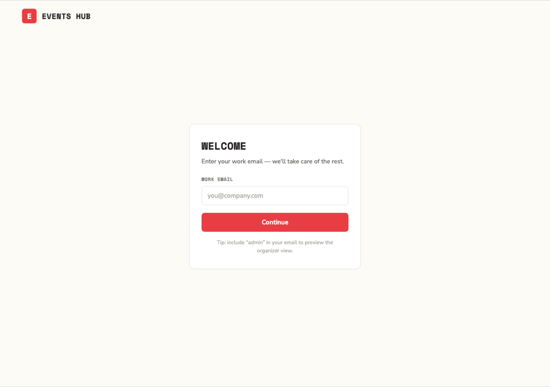
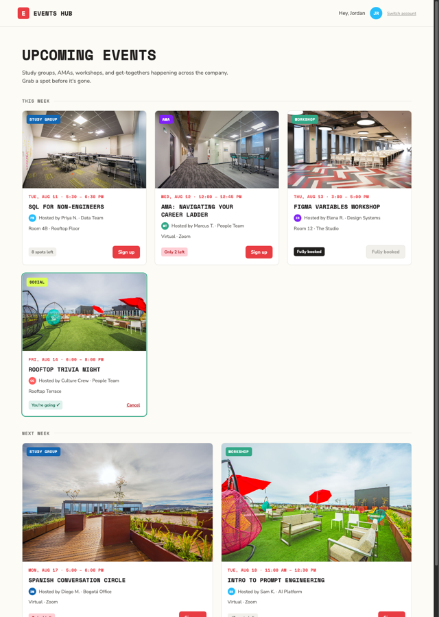
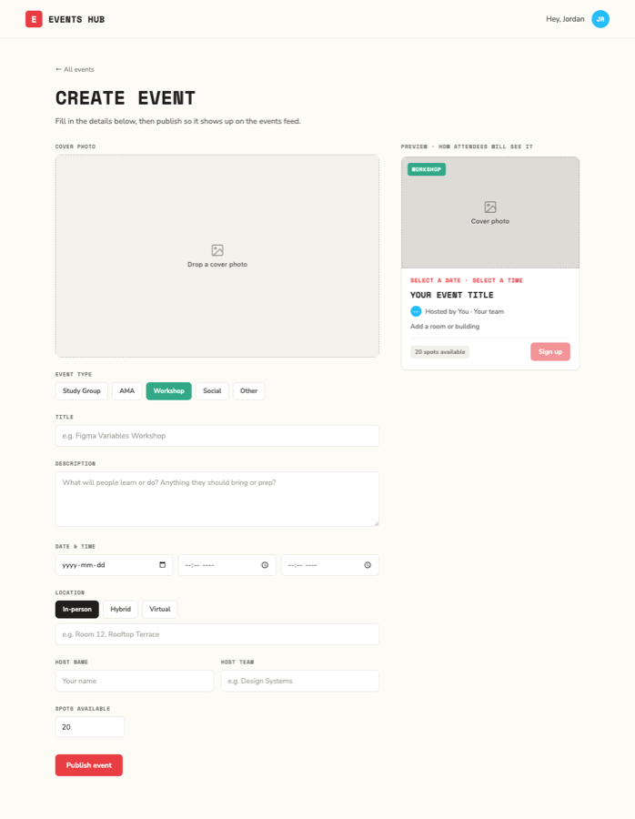
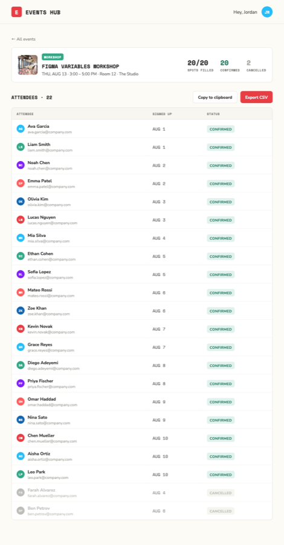

# Community Events Hub — Product Brief

Status: **approved for implementation**. This document is the single source of truth for scope, data model, and API contract. Written before any application code exists; changes to it during implementation must be reflected here, not silently made in code.

## 1. Objective & Vision

Give the company an internal, self-serve way to publish events — study groups, AMAs, workshops, socials — and let employees find them and sign up, without anyone touching a spreadsheet or a shared inbox.

- Organizers can publish an event in under a minute and know exactly who's coming.
- Attendees can see what's happening company-wide and claim a spot before it fills up.

## 2. Target Audience

| Persona | Who they are | What they need |
|---|---|---|
| **Attendee** | Any employee browsing for something to join | A clear, up-to-date list of upcoming events and a fast way to RSVP or back out |
| **Organizer** | An employee running a study group, AMA, workshop, etc. (`is_admin = true`) | A fast way to publish an event and a reliable attendee list they can act on (email, headcount for the room, etc.) |

Both personas are internal employees on the company network — this is not a public-facing product.

## 3. Features by Persona

**Organizer** (everything an Attendee can do, plus):
- Create an event (title, date/time, description, capacity, type, location, cover photo)
- View the organizer attendance view for an event (roster + counts)
- Export the attendee list as CSV
- Copy the attendee list to the clipboard

**Attendee:**
- Log in with a company email
- See the list of published (future) events, soonest first
- View an event's details
- Sign up for an event
- Cancel their own sign-up

## 4. Scope

**In scope**
- Log in with company email (see [§7.1](#71-authentication))
- Create an event (organizer only)
- Organizer attendance view, CSV export, copy-to-clipboard (organizer only)
- Public list of upcoming events with live remaining-spots count
- Event detail view
- Sign up for an event
- Cancel a sign-up

**Out of scope** (explicitly, for this MVP)
- Self-service account creation, sign-up-as-a-user, or profile editing
- Any authentication beyond an email-only login (no passwords, no MFA/SSO — Google, Okta, GitHub, etc.)
- Editing or cancelling an already-published event
- Any notifications — email, Slack, push, or social — including invites
- Calendar integration (Google Calendar, Outlook, Apple Calendar)
- Any sharing mechanism (email, social media, copy link, etc.)

## 5. Edge Cases the Implementation Must Handle

- Malformed email at login (`not-an-email`, empty string, trailing whitespace) → rejected before any DB lookup
- Login with a well-formed email that has no matching user record → rejected (see [§7.1](#71-authentication) — no account creation)
- Empty or whitespace-only event title → rejected
- Zero, negative, or non-integer capacity → rejected
- `end` not strictly after `start` → rejected
- Invalid `event_type` / `location_type` (not one of the enum values) → rejected
- Signing up for an event that's already full → rejected with `400` and a clear, specific "event is full" message (not a generic validation error)
- Signing up twice while already confirmed for the same event → rejected as a duplicate, no double-booked spot
- Re-signing up after a prior cancellation for the same event → allowed (see the `Users_Events` table in [§7.3](#73-data-model))
- Cancelling a sign-up that doesn't exist, or for an event that doesn't exist → rejected, no partial state
- Non-admin attempting any organizer-only action (create event, view/export attendance) → rejected, and the response must not leak whether the resource exists
- A non-admin's view of events (list, details) must never include another attendee's name or email — only the organizer attendance view does

## 6. Acceptance Criteria

The MVP is done when all of the following hold end-to-end, starting from `solution/README.md` alone on a clean checkout:

1. An organizer creates an event with valid data → it appears in the public feed, sorted soonest-first, with the correct remaining-spots count.
2. An attendee with a valid, seeded company email signs up for an event with open spots → registration is confirmed, remaining spots decrement by one, and the attendee appears as `Confirmed` in the organizer's attendance view.
3. The same attendee attempting to sign up again for the same event is rejected as a duplicate; no second spot is consumed.
4. An attendee attempting to sign up for a full event is rejected with `400` and a distinct "event is full" message, not a generic validation error.
5. An attendee cancels a confirmed sign-up → their status becomes `Cancelled`, the spot returns to the pool, and they still appear (as `Cancelled`, not deleted) in the organizer's attendance view.
6. A non-admin cannot create an event, view attendance, or export/copy the attendee list for any event.
7. The public event list and event detail views never expose another attendee's name, email, or sign-up status.
8. The organizer can export the attendee list as a CSV and copy it to the clipboard, both reflecting current `Confirmed`/`Cancelled` state.
9. Invalid input (malformed email, non-positive capacity, empty title, bad enum values, `end <= start`) is rejected with a 400 and no record is created or mutated.
10. The app starts from a clean checkout using only the instructions in `solution/README.md` — no undocumented setup steps.

## 7. Technical Design

### 7.1 Authentication

`POST /login` takes only a company email — no password, no MFA. Because account creation is explicitly out of scope, **the system does not create users on login**. It ships with a small set of **seeded fixture users** (a mix of `is_admin = true` and `false`), loaded when the database is initialized. Login succeeds only for an email that matches a seeded user (case-insensitive); any other well-formed email gets a 401, not a new account. The seeded emails and their roles must be listed in `solution/README.md` so the app is actually usable on a clean checkout.

On success, `POST /login` returns a **JWT** carrying `sub` (user id), `email`, and `is_admin`, signed with a secret read from an environment variable (never hardcoded — see the future `SECURITY_CHECK.md`). The client sends it as `Authorization: Bearer <token>` on every subsequent request. There is no refresh/logout flow in this MVP; the token simply has a fixed expiry (e.g., 24h) and the frontend discards it client-side on "Switch account."

### 7.2 Persistence

- **SQLite** for all structured data (users, events, registrations). A single `.db` file, created automatically on first run if missing.
- A local **filesystem folder** for public event cover-image assets, served statically; the DB stores only the resulting path/URL, never the image bytes.
- No in-memory caching layer in this MVP — SQLite is the only store, which also gives us durability across restarts for free.
- Seed data loaded at DB init includes a fixture set of events for local development and grading: **two events per photo** available in [`mockups/project/assets/photos/`](../mockups/project/assets/photos/) (14 events total), with `start` dates spread across the remaining months of the current year from the deployment date. None are in the past — a past `start` would never show up on the Feed (§7.4 `GET /events`), so seeding one would be pointless.

### 7.3 Data Model

**Users**
| Field | Type | Notes |
|---|---|---|
| `id` | bigint | PK |
| `first_name` | text | required, 1–80 characters |
| `last_name` | text | required, 1–80 characters |
| `email` | text | required, unique, email-formatted |
| `is_admin` | boolean | required, default `false` |
| `created_at` | datetime | required, set on insert |
| `updated_at` | datetime | required, refreshed on every update |

**Events**
| Field | Type | Notes |
|---|---|---|
| `id` | bigint | PK |
| `title` | text | required, non-empty after trim, 3–140 characters |
| `start` | datetime | required |
| `end` | datetime | required, must be after `start` |
| `spots` | positive integer | required — this is the **total capacity** set at creation, not a live count. Remaining availability is always computed as `spots − count(Users_Events WHERE status='Confirmed')`, never stored. |
| `event_type` | enum | required: `study_group`, `ama`, `workshop`, `social`, `other` |
| `location_type` | enum | required: `in_person`, `hybrid`, `virtual` |
| `description` | text | optional, up to 2000 characters |
| `image` | text | optional — path to the uploaded cover image (see [§7.4](#74-api) and the validation rules below) |
| `location` | array(text) | optional, up to 5 entries of up to 200 characters each — e.g. `["Room 12, Rooftop Floor"]`, or `["Virtual", "https://zoom.us/..."]` for hybrid. See validation rules below. |
| `host_name` | text | optional, up to 100 characters |
| `host_team` | text | optional, up to 100 characters |
| `created_at` | datetime | required, set on insert |
| `updated_at` | datetime | required, refreshed on every update |

No `created_by`/organizer column: any user with `is_admin = true` can create events and manage attendance for **any** event — there's a single flat organizer role in this MVP, not per-event ownership.

**Cover photo validation.** The uploaded `image` file must be jpeg/png/webp, verified server-side from the file's actual magic bytes — not just its extension or client-sent `Content-Type` header — and rejected otherwise (this also blocks SVG, which can carry embedded scripts). Minimum 400×250px; maximum 5MB and 4000×4000px. Accepted files are re-encoded and stripped of EXIF metadata, then saved under a server-generated filename — never the client-supplied one — to avoid path traversal or filename collisions.

**Virtual/hybrid location validation.** When `location_type` is `virtual` or `hybrid`, at least one entry in `location` must be a well-formed URL (e.g., a Zoom, Google Meet, or YouTube link) — a plain room name alone is rejected for those two types.

**Users_Events** (registrations)
| Field | Type | Notes |
|---|---|---|
| `id` | bigint | PK |
| `user_id` | bigint | required, FK → `Users.id` |
| `event_id` | bigint | required, FK → `Events.id` |
| `status` | enum | required: `Confirmed`, `Cancelled` |
| `sign_up_at` | datetime | required, set/refreshed each time status moves to `Confirmed` |
| `created_at` | datetime | required, set on insert |
| `updated_at` | datetime | required, refreshed on every update |

Unique constraint on `(user_id, event_id)` — **one row per user per event**. A cancellation sets `status = 'Cancelled'`; it never deletes the row. Signing up again after a cancellation updates that same row back to `Confirmed` with a new `sign_up_at`, rather than being treated as a duplicate — the duplicate check only blocks a *second* `Confirmed` registration.

### 7.4 API

JSON over HTTP for everything **except** event creation. Base path and versioning are an implementation detail; all endpoints below assume `Authorization: Bearer <token>` unless noted otherwise.

| Endpoint | Auth | Purpose | Success | Errors |
|---|---|---|---|---|
| `POST /login` | none | Authenticate by email, issue JWT | `200 OK` | `400` malformed email · `401` email not recognized |
| `POST /event` | admin | Create an event. **`multipart/form-data`**, not JSON — the other event fields are form fields, plus an optional `image` file part (jpeg/png/webp, size-limited server-side) | `201 Created` | `401` · `403` · `400` invalid/missing fields |
| `GET /events` | any user | Future events only, ordered by `start` ascending, each with computed remaining spots | `200 OK` | `401` |
| `GET /event/:id/details` | any user | Single event's public details — no attendee data | `200 OK` | `401` · `400` bad id · `404` |
| `GET /event/:id/attendance` | admin | Full roster for an event: name, email, `sign_up_at`, status | `200 OK` | `401` · `403` · `400` · `404` |
| `GET /event/:id/attendance/download` | admin | CSV of the roster. Filename: `${event_name}-${start_date:YYYY-MM-DD}-${today:YYYY-MM-DD}.csv`. Columns: `full_name`, `email`, `sign_up_at`, `status` | `200 OK` | `401` · `403` · `400` · `404` |
| `POST /event/:id/register` | any user | Caller signs themself up (identity from the JWT, not the body) | `201 Created` | `401` · `400` event is full, already confirmed, or invalid input · `404` |
| `DELETE /event/:id/register` | any user | Caller cancels their own registration (sets `status = 'Cancelled'`) | `204 No Content` | `401` · `400` no active registration · `404` |

Every endpoint may additionally return `500 Internal Server Error` (unexpected server-side failure) or `503 Service Unavailable` (e.g., the database is temporarily unreachable) — omitted from the per-row lists above since they apply uniformly and aren't business-logic outcomes.

All endpoints validate input against the Data Model in [§7.3](#73-data-model) — a request that fails validation must not create or mutate any row.

### 7.5 Frontend

React SPA. The four screens and their exact layout, spacing, color, and type are defined pixel-for-pixel in [`mockups/project/`](../mockups/project/) (`Login`, `Feed`, `Create Event`, `Organizer View` `.dc.html` files) — implementers should read those directly rather than this brief restating every value. Rendered for quick reference (mock/placeholder data, not the real seed data):

| Login | Feed |
|---|---|
|  |  |

| Create Event | Organizer View |
|---|---|
|  |  |

Notable behaviors captured there that the brief calls out explicitly because they affect the API contract:

- The Feed shows events grouped by week, each card with a spots-remaining badge (`full` / `low` / `open` / already-`registered` states) and a CTA that adapts to the viewer's registration status; clicking a card opens a detail modal with the same CTA logic.
- A registered attendee sees an inline **Cancel** action on both the card and the detail modal — no separate confirmation screen.
- Create Event is admin-only, with a live preview pane mirroring exactly how the event will render on the Feed.
- The Organizer View is a single event's roster with header stats (spots filled, confirmed, cancelled), a table (avatar, name, email, `sign_up_at`, status), and **Export CSV** / **Copy to clipboard** actions — both use the same `full_name, email, sign_up_at, status` shape as the API's CSV export.
- Client-side routing gates Create Event and Organizer View behind `is_admin` from the JWT; hitting the underlying API directly without admin rights must still get a `403` regardless of what the UI hides.
- Every server-side validation rule in [§7.3](#73-data-model) must also be enforced client-side before a request is even sent — e.g., blocking submission on an empty/malformed login email, an empty title, or a non-positive capacity — so the user gets immediate inline feedback instead of waiting on a round-trip. This is a UX layer only: the API re-validates everything server-side regardless of what the client already checked.

