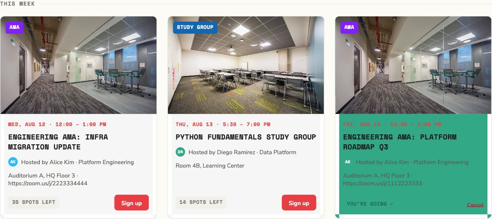
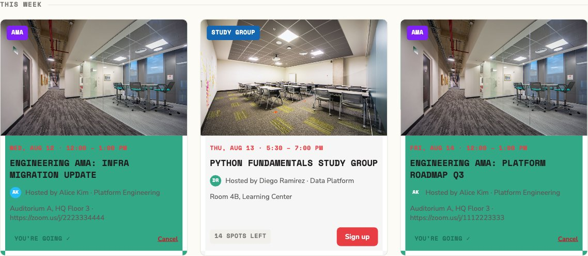
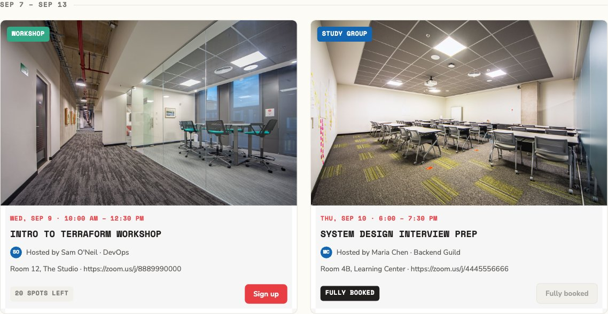
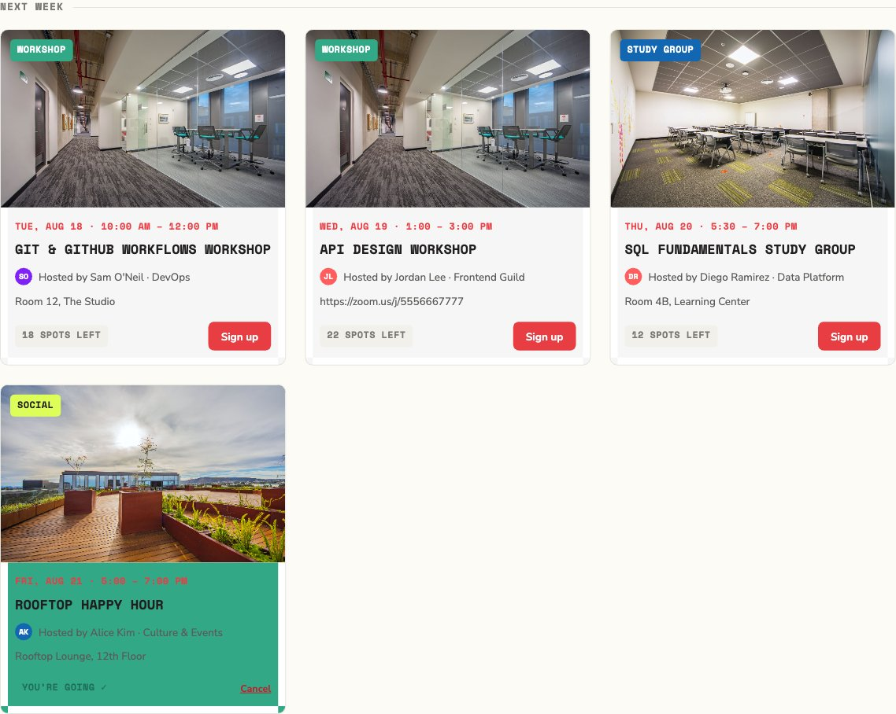

# Verification Note

**1. What the AI got wrong (or almost wrong):**
- Folder and files organization through the different implementations (database, backend, frontend, documentation, etc.).
- The Organizer View's "Export CSV" button downloaded as a generic `attendance.csv` instead of the spec'd `<slug>-<start>-<today>.csv`. The backend set `Content-Disposition` correctly and 73 backend tests all passed — the bug was invisible to them because `Content-Disposition` isn't in the browser's default CORS-exposed response headers, so the frontend's `fetch()` could never actually read it cross-origin. It only showed up under a real browser, never under Flask's test client.

**2. How I caught it:**
- Manual testing
- Code review
- Diff review
- Automated review

**3. How I confirmed the final result is correct:**

Exercised the three required flows directly against the API (bypassing the UI, via curl) to confirm server-side enforcement rather than trusting client-side behavior:
- **Successful sign-up** — `POST /event/15/register` → `201`, `remaining_spots` 35→34, `viewer_status` null→`confirmed`.
- **Full-event rejection** — a user who'd never registered for event 4 (`spots=3`, already at 0 remaining) → `POST /event/4/register` → `400 event_full`.
- **Duplicate-registration rejection** — re-registering an already-confirmed user for event 15 → `400 already_registered` (a distinct error code from `event_full`, confirming these are two separately-tested branches, not one check standing in for both).

Cancel was checked too, for completeness: `DELETE /event/15/register` → `204`, and cancelling again correctly → `400 no_active_registration`.

---

## Test Scenarios — Manual Verification Evidence

The three required flows, each re-run on 2026-08-11 against a freshly-seeded database with paired evidence: a UI screenshot (before/after where applicable) and the exact `curl` call + raw response, so either can be checked independently without trusting the other. Seeded accounts and event ids referenced below come straight from `backend/scripts/seed_data.py`.

### Scenario 1 — Successful sign-up

| | |
|---|---|
| **User** | `priya.shah@company.com` (attendee-facing action; admin role is irrelevant here) |
| **Event** | #15 — *Engineering AMA: Infra Migration Update* (35 spots, none taken) |
| **Input** | `POST /event/15/register`, `Authorization: Bearer <priya-token>`, no body |
| **Expectation** | `201 Created`; `remaining_spots` decrements 35→34; `viewer_status` flips `null`→`"confirmed"`; the feed card switches from a spots-left badge + "Sign up" to "You're going ✓" + "Cancel", with no page reload needed |

**UI — before** (event card shows `35 SPOTS LEFT` / `Sign up`):



**UI — after** (card now shows `YOU'RE GOING ✓` / `Cancel`):



**API call and actual response:**

```bash
curl -s -X POST http://localhost:5000/event/15/register \
  -H "Authorization: Bearer $TOKEN"
```

```json
HTTP 201
{
  "id": 15,
  "title": "Engineering AMA: Infra Migration Update",
  "spots": 35,
  "remaining_spots": 34,
  "viewer_status": "confirmed",
  "...": "(full event object omitted for brevity — see docs/API.md for the shape)"
}
```

**Result:** matches expectation exactly. ✅

---

### Scenario 2 — Rejection when an event is full

| | |
|---|---|
| **User** | `maria.chen@company.com` — deliberately someone who had **never** registered for this event, so the rejection is provably about capacity, not about being conflated with the duplicate-registration case in Scenario 3 |
| **Event** | #4 — *System Design Interview Prep* (`spots=3`, 3 already `Confirmed` via seed data → 0 remaining) |
| **Input** | `POST /event/4/register`, `Authorization: Bearer <maria-token>`, no body |
| **Expectation** | `400 Bad Request`, `error: "event_full"`; no row written; the feed's CTA for this event is already rendered as a disabled "Fully booked" button, so a real UI user can't even trigger this request — it's only reachable by calling the API directly, which is exactly why it needs to be independently verified server-side |

**UI** (the card's CTA is already disabled — `FULLY BOOKED` badge, greyed-out "Fully booked" button, no click possible):



**API call and actual response** (bypassing the disabled UI button entirely, hitting the endpoint directly):

```bash
curl -s -X POST http://localhost:5000/event/4/register \
  -H "Authorization: Bearer $TOKEN"
```

```json
HTTP 400
{
  "error": "event_full",
  "message": "This event is full.",
  "details": null
}
```

**Result:** matches expectation exactly — rejected server-side even for a request the UI itself would never let a real user send. ✅

---

### Scenario 3 — Rejection of a duplicate sign-up

| | |
|---|---|
| **User** | `diego.ramirez@company.com` — already `Confirmed` on this event via seed data |
| **Event** | #9 — *Rooftop Happy Hour* (50 spots, plenty remaining — the rejection here is specifically about the duplicate, not capacity, unlike Scenario 2) |
| **Input** | `POST /event/9/register`, `Authorization: Bearer <diego-token>`, no body — a second registration attempt for an event he's already confirmed on |
| **Expectation** | `400 Bad Request`, `error: "already_registered"` — a distinct code from `event_full`, proving these are two separately-enforced rules and not one check standing in for both; no duplicate row written |

**UI** (card already shows `YOU'RE GOING ✓` / `Cancel` — the UI itself only offers "Cancel" here, never a second "Sign up", so this too is only reachable by calling the API directly):



**API call and actual response:**

```bash
curl -s -X POST http://localhost:5000/event/9/register \
  -H "Authorization: Bearer $TOKEN"
```

```json
HTTP 400
{
  "error": "already_registered",
  "message": "You are already registered for this event.",
  "details": null
}
```

**Result:** matches expectation exactly, and the error code (`already_registered`) is confirmed distinct from Scenario 2's (`event_full`). ✅

---
