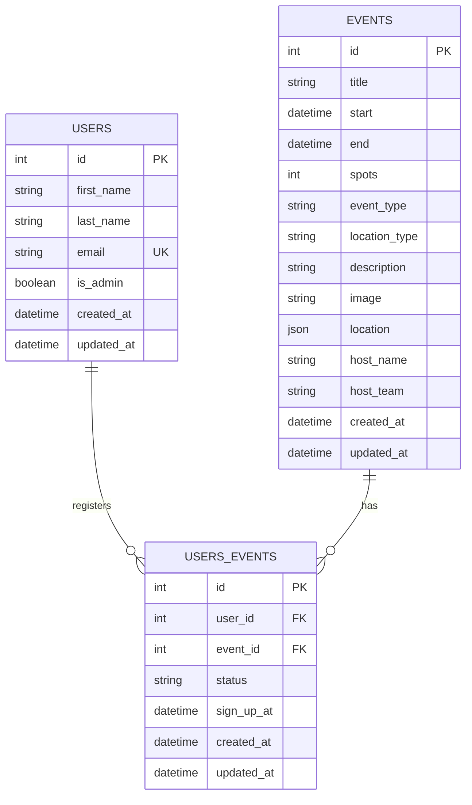

# Database Reference

Full schema reference for the Community Events Hub backend. Source of truth
for the data model itself is [`../../BRIEF.md`](../../BRIEF.md) §7.3 — this
document explains how that model is actually implemented on SQLite via
SQLAlchemy, plus the migration workflow and seed dataset.

## Entity-relationship diagram



No `created_by`/organizer column on `EVENTS`: any `USERS.is_admin = true`
user manages any event — a single flat organizer role in this MVP, not
per-event ownership.

## Tables

### `users`

| Column       | Type           | Constraints                            |
| ------------ | -------------- | -------------------------------------- |
| `id`         | `INTEGER`      | PK, autoincrement (SQLite rowid alias) |
| `first_name` | `VARCHAR(80)`  | `NOT NULL`                             |
| `last_name`  | `VARCHAR(80)`  | `NOT NULL`                             |
| `email`      | `VARCHAR(254)` | `NOT NULL`, `UNIQUE` (indexed)         |
| `is_admin`   | `BOOLEAN`      | `NOT NULL`, default `false`            |
| `created_at` | `DATETIME`     | `NOT NULL`                             |
| `updated_at` | `DATETIME`     | `NOT NULL`                             |

Users are **never created by the app itself** — account creation is out of
scope for this MVP (see BRIEF §4). The only rows that exist are the ones
loaded by the seed migration (below). A future login endpoint authenticates
against these rows and rejects any email that doesn't match one.

### `events`

| Column          | Type           | Constraints                                                                           |
| --------------- | -------------- | ------------------------------------------------------------------------------------- |
| `id`            | `INTEGER`      | PK                                                                                    |
| `title`         | `VARCHAR(140)` | `NOT NULL`                                                                            |
| `start`         | `DATETIME`     | `NOT NULL`                                                                            |
| `end`           | `DATETIME`     | `NOT NULL`, `CHECK ("end" > start)`                                                   |
| `spots`         | `INTEGER`      | `NOT NULL`, `CHECK (spots > 0)`                                                       |
| `event_type`    | `VARCHAR(11)`  | `NOT NULL`, `CHECK (event_type IN ('study_group','ama','workshop','social','other'))` |
| `location_type` | `VARCHAR(9)`   | `NOT NULL`, `CHECK (location_type IN ('in_person','hybrid','virtual'))`               |
| `description`   | `TEXT`         | nullable                                                                              |
| `image`         | `VARCHAR(255)` | nullable — path relative to `uploads/`, e.g. `"events/ama-room.jpg"`                  |
| `location`      | `JSON`         | nullable — array of strings, e.g. `["Room 12", "https://zoom.us/..."]`                |
| `host_name`     | `VARCHAR(100)` | nullable                                                                              |
| `host_team`     | `VARCHAR(100)` | nullable                                                                              |
| `created_at`    | `DATETIME`     | `NOT NULL`                                                                            |
| `updated_at`    | `DATETIME`     | `NOT NULL`                                                                            |

`spots` is **total capacity set at creation, not a live count**. Remaining
availability is always computed as
`spots - COUNT(users_events WHERE event_id = events.id AND status = 'Confirmed')`
— never stored as a column, so it can't drift out of sync with actual
registrations.

Field-length bounds (title 3–140, description ≤2000, etc.) and content
validation (cover-photo format/size, virtual-location URL) from BRIEF §7.3
are **deliberately not enforced at the DB layer** — SQLite ignores
`VARCHAR(n)` length modifiers outright, and the rest is business validation
that belongs in the future API phase, not duplicated into schema DDL.

### `users_events` (registrations)

| Column       | Type         | Constraints                                               |
| ------------ | ------------ | --------------------------------------------------------- |
| `id`         | `INTEGER`    | PK                                                        |
| `user_id`    | `INTEGER`    | `NOT NULL`, FK → `users.id`                               |
| `event_id`   | `INTEGER`    | `NOT NULL`, FK → `events.id`                              |
| `status`     | `VARCHAR(9)` | `NOT NULL`, `CHECK (status IN ('Confirmed','Cancelled'))` |
| `sign_up_at` | `DATETIME`   | `NOT NULL`                                                |
| `created_at` | `DATETIME`   | `NOT NULL`                                                |
| `updated_at` | `DATETIME`   | `NOT NULL`                                                |
| —            | —            | `UNIQUE (user_id, event_id)`                              |

One row per user per event. A cancellation sets `status = 'Cancelled'`; it
never deletes the row. Re-signing up after a cancellation is expected to
flip that same row back to `Confirmed` with a new `sign_up_at`, rather than
inserting a second row — the unique constraint only ever blocks a *second
`Confirmed`* registration attempt.

## SQLite-specific implementation notes

A few places where the data model above doesn't map onto SQLite 1:1, and
what was done about it (see inline comments in `app/models/` for the
detail on each):

- **`bigint` (BRIEF) → `INTEGER`.** SQLite's `INTEGER` storage class is
  already 8-byte, and a primary key is only aliased to SQLite's fast
  native `rowid` (free auto-increment) when the DDL says exactly
  `INTEGER PRIMARY KEY` — `BigInteger` would emit `BIGINT PRIMARY KEY`,
  losing that rowid aliasing for no benefit.
- **Enums → `db.Enum(PyEnum, values_callable=..., create_constraint=True)`.**
  SQLite has no native enum type; this combination emits a `VARCHAR`
  column plus an inline `CHECK (col IN (...))`, so enforcement is real at
  the DB layer.
  - `values_callable` is required because BRIEF's wire values
    (`study_group`, `Confirmed`) aren't valid Python `UPPER_SNAKE` member
    names — without it, SQLAlchemy silently persists the member *name*
    instead of its *value*.
  - `create_constraint=True` is required because **SQLAlchemy 2.0 changed
    this default from `True` to `False`**. This one was caught the hard
    way during this phase: without it, every enum column was a bare
    `VARCHAR` with zero DB-level enforcement — an invalid string inserted
    silently, and only surfaced later as a confusing `LookupError` when
    SQLAlchemy tried to map the bad value back to a Python enum member on
    read-back. `tests/test_event_model.py` and
    `tests/test_registration_model.py` both assert `IntegrityError` on an
    invalid enum value specifically to keep this regression-proof.
- **`location` array(text) → `db.JSON`.** Stored as `TEXT` with automatic
  Python-list ↔ JSON (de)serialization at the ORM boundary; no SQLite
  extension required.
- **SQLite foreign keys are OFF by default, per-connection.** Without the
  `PRAGMA foreign_keys=ON` connect-event listener in `app/extensions.py`,
  the FKs on `users_events` would exist in the schema but silently allow
  orphan rows. This applies to every connection the app, CLI, tests, and
  Alembic all open (`tests/test_registration_model.py::test_foreign_key_enforcement_rejects_orphan_ids`
  proves it's actually wired up).
- **`end` is a reserved SQLite keyword** (`CASE ... END`). SQLAlchemy
  auto-quotes it in generated DDL/DML; a hand-written `sqlite3` CLI query
  must quote it too: `SELECT id, title, "end" FROM events;`.

## Migrations

Alembic (`migrations/`) is the source of truth for schema **and** the
initial seed data — deliberately not `db.create_all()` for normal runs
(see `app/__init__.py`'s `create_app()` docstring: `init_db` defaults to
`False` there specifically to avoid racing against Alembic when
`flask db-setup` boots the app before its own command body runs).

- **`0001_..._initial_schema.py`** — autogenerated from the SQLAlchemy
  models: `CREATE TABLE` for all three tables plus every constraint above.
- **`0002_..._seed_initial_data.py`** — a data-only migration. `upgrade()`
  copies the 7 mockup photos into `uploads/events/` (idempotent, skips
  files already present) then bulk-inserts the fixture users/events/
  registrations defined in `scripts/seed_data.py`, using SQLAlchemy Core
  (`sa.table`/`op.bulk_insert`), not the ORM models — a migration must stay
  pinned to the schema shape it was written against, which the ORM classes
  are free to move on from in later phases. `downgrade()` deletes the
  seeded rows by their natural keys (email / title), not a blanket
  DELETE-all, in case other data has been added alongside the fixtures by
  the time someone downgrades.
- `migrations/env.py` sets `render_as_batch=True` — SQLite's limited
  `ALTER TABLE` support means any future schema-changing migration almost
  certainly needs it; harmless to set now even though `0001` doesn't need
  it.

To add a schema change in a future phase:

```bash
# after changing a model in app/models/
poetry run alembic revision --autogenerate -m "describe the change"
# review the generated file in migrations/versions/ before applying
poetry run alembic upgrade head
```

## Seed data

Loaded by `0002_seed_initial_data.py` from `scripts/seed_data.py`, the
single place this content is defined (the migration imports it — no
duplication).

**8 users** (2 admins, 6 attendees) — see `scripts/seed_data.py::USERS` for
the full list of emails; these are the only accounts that can log in, since
this MVP never creates users itself.

**35 events** — 5 per each of the 7 photos in
`../../mockups/project/assets/photos/`, dated Aug–Dec 2026 (all in the
future relative to this phase's build date), weighted toward the near
term and tapering off by year end (11/9/7/5/3 events per month,
Aug→Dec) rather than spread evenly, every `event_type` and
`location_type` value used at least once, every optional field populated
(no nulls). Full details in `scripts/seed_data.py::EVENTS`.

**16 registrations**, deliberately covering the states the mockups show:

| Event                                                               | Scenario                                                                                 |
| ------------------------------------------------------------------- | ---------------------------------------------------------------------------------------- |
| *System Design Interview Prep* (spots=3)                            | 3 `Confirmed` → **full**, remaining = 0                                                  |
| *Advanced React Patterns Workshop* (spots=5)                        | 4 `Confirmed` → **nearly full**, remaining = 1                                           |
| *End-of-Summer Rooftop Social* (spots=6)                            | 2 `Confirmed` + 1 `Cancelled` → proves cancellation is a status flip, not a row deletion |
| *Engineering AMA*, *Rooftop Happy Hour*, *Fall Rooftop Swing Party* | a few `Confirmed` rows each, ambient realism                                             |

Verify at any time:

```bash
sqlite3 instance/app.db "
SELECT e.title, e.spots,
       COUNT(CASE WHEN ue.status='Confirmed' THEN 1 END) AS confirmed,
       e.spots - COUNT(CASE WHEN ue.status='Confirmed' THEN 1 END) AS remaining
FROM events e LEFT JOIN users_events ue ON ue.event_id = e.id
GROUP BY e.id ORDER BY remaining ASC;"
```
